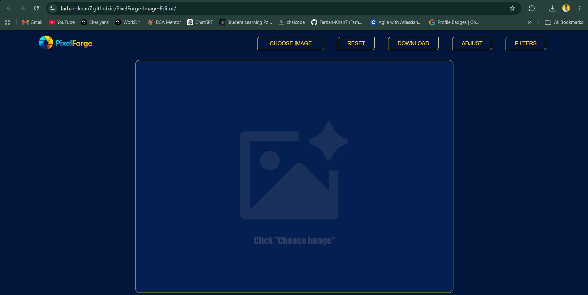
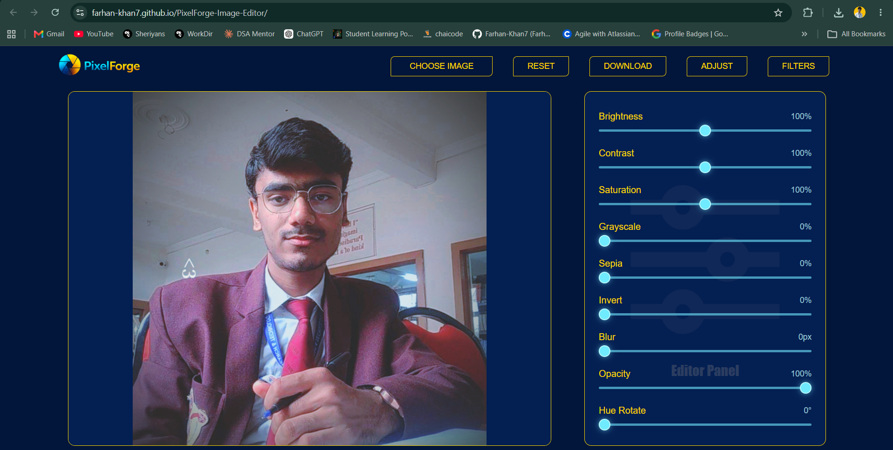

# 🎨 PixelForge

> A modern browser-based photo editor built with **HTML, CSS, and Vanilla JavaScript**.

PixelForge is a lightweight image editing application that allows users to upload images, apply real-time filters, use cinematic preset effects, and download the edited image directly from the browser without relying on any external libraries or frameworks.

---

## 📸 Preview

> **Live Demo:** *(Add your deployed link here)*

> **Screenshots:** *(Add screenshots inside an `assets` folder and replace the links below)*

| Home | Editing |
|------|---------|
|  |  |

---

# ✨ Features

### 📂 Image Upload

- Upload images directly from your device.
- Instant preview after selection.

---

### 🎛️ Real-Time Image Controls

Adjust your image using interactive sliders.

- ☀️ Brightness
- 🌗 Contrast
- 🎨 Saturation
- ⚫ Grayscale
- 🟤 Sepia
- 🔄 Hue Rotate
- 🌫 Blur
- 🔁 Invert
- 👻 Opacity

Every change updates the preview instantly.

---

### 🎨 Preset Filters

Apply professional-looking filters with one click.

- Original
- Vintage
- Warm
- Cool
- Dramatic
- Noir
- Faded
- Dreamy
- Cyberpunk
- Cinematic

---

### 🔄 Reset Filters

Restore every adjustment back to its default value with a single click.

---

### 💾 Download Edited Image

Download the edited image directly as a PNG using the HTML5 Canvas API while preserving all applied filters.

---

# 🛠 Tech Stack

| Technology | Purpose |
|------------|---------|
| HTML5 | Structure |
| CSS3 | Styling |
| JavaScript (ES6) | Application Logic |
| Canvas API | Image Export |
| CSS Filters | Live Image Editing |

---

# 📁 Folder Structure

```
PixelForge
│
├── assets
│   ├── images
│   └── screenshots
│
├── index.html
├── style.css
├── script.js
└── README.md
```

---

# ⚙️ How It Works

## 1️⃣ Upload Image

The selected image is loaded using the File API.

```javascript
URL.createObjectURL(file)
```

---

## 2️⃣ Apply Filters

Each slider updates a centralized JavaScript object.

```javascript
const Filters = {
    brightness: 100,
    contrast: 100,
    saturation: 100,
    grayscale: 0,
    sepia: 0,
    invert: 0,
    blurimg: 0,
    opacity: 100,
    hueRotate: 0
};
```

The image preview updates in real time using CSS filters.

---

## 3️⃣ Preset Filters

Every preset is stored inside a dedicated object.

```javascript
presetFilters = {
    vintage: {...},
    warm: {...},
    cool: {...},
    cinematic: {...}
}
```

Using `Object.assign()`, the selected preset updates all filter values instantly.

---

## 4️⃣ Download Process

The edited image is exported using the HTML5 Canvas API.

```
Image
   │
   ▼
Canvas
   │
   ▼
Canvas Filters
   │
   ▼
Draw Image
   │
   ▼
PNG
   │
   ▼
Download
```

---

# 🧠 Concepts Learned

While building PixelForge, I learned and practiced:

- DOM Manipulation
- Event Handling
- File API
- URL.createObjectURL()
- CSS Filters
- HTML5 Canvas API
- JavaScript Objects
- Object.assign()
- Dataset Attributes
- Dynamic UI Updates
- State Management
- Image Processing Basics

---

# 🚀 Future Improvements

- Crop Tool
- Rotate Image
- Flip Horizontal / Vertical
- Resize Image
- Undo / Redo
- Drag & Drop Upload
- Zoom Controls
- Before / After Comparison
- Responsive Design
- Export as JPG & WebP
- Keyboard Shortcuts
- Local Storage Support

---

# 📚 Challenges I Solved

During this project I learned how to:

- Manage multiple image filters simultaneously.
- Synchronize UI sliders with application state.
- Build reusable preset filters.
- Reset all filters efficiently.
- Export edited images using Canvas.
- Organize JavaScript into reusable functions.
- Keep the interface synchronized with user interactions.

---

# 💡 What Makes This Project Special?

- ✅ No external JavaScript libraries.
- ✅ Pure Vanilla JavaScript.
- ✅ Beginner-friendly architecture.
- ✅ Real-time image processing.
- ✅ Download edited images directly in the browser.
- ✅ Easy to extend with new filters and tools.

---

# 📷 Screenshots

## Home Screen

> Replace with your screenshot.

```
assets/screenshots/home.png
```

---

## Editing Panel

> Replace with your screenshot.

```
assets/screenshots/editor.png
```

---

## Preset Filters

> Replace with your screenshot.

```
assets/screenshots/presets.png
```

---

# 🚀 Getting Started

Clone the repository

```bash
git clone https://github.com/Farhan-Khan7/PixelForge-Image-Editor.git
```

Open the project folder

```bash
cd PixelForge
```

Run

Simply open

```
index.html
```

inside your browser.

---

# 🤝 Contributing

Contributions, suggestions and improvements are always welcome.

Feel free to fork this repository and submit a pull request.

---

# 👨‍💻 Author

## Farhan Khan (Mark)

Frontend Developer | JavaScript Learner

- 💼 LinkedIn: https://www.linkedin.com/in/farhan-khan-b99737254/
- 🐙 X: https://x.com/FarhanK43883

---

# ⭐ Support

If you enjoyed this project, consider giving it a ⭐ on GitHub.

It motivates me to build more open-source projects.

---

## ❤️ Built with HTML, CSS & JavaScript